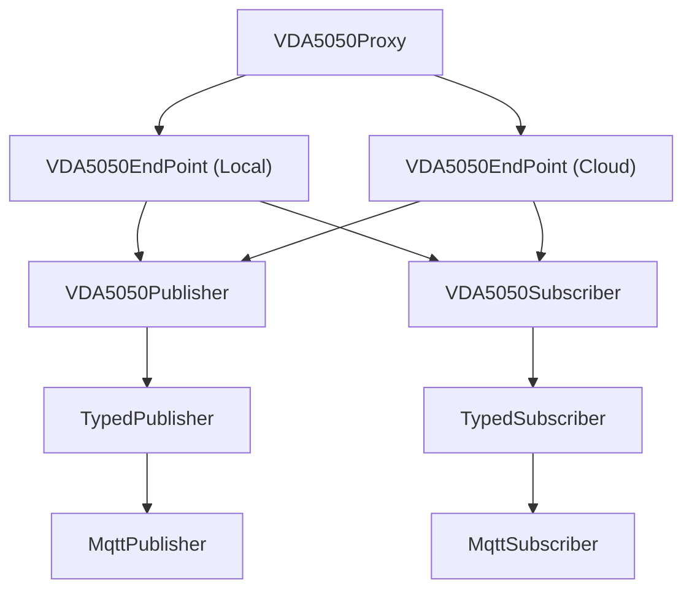

# MQTT Directory Architecture

This directory is organized as a layered architecture with clear responsibilities at each level:

1. `MqttPublisher` and `MqttSubscriber` form the transport layer and provide a minimal abstraction over the underlying MQTT client.
2. `TypedPublisher` and `TypedSubscriber` implement typed messaging by handling serialization and deserialization, exposing statically typed interfaces to higher layers.
3. `VDA5050Publisher` and `VDA5050Subscriber` define the protocol layer for VDA5050 message publishing and subscription.
4. `VDA5050EndPoint` composes the VDA5050 publisher and subscriber and applies side-specific behavior (`Local` or `Cloud`).
5. `VDA5050Proxy` is the top-level orchestration component, using two `VDA5050EndPoint` instances to bridge traffic between local and cloud sides.
6. `VDA5050TopicContext` represents the VDA5050 topic schema (`interfaceName`, `majorVersion`, `manufacturer`, `serialNumber`) and is used to construct and interpret protocol topics consistently.

